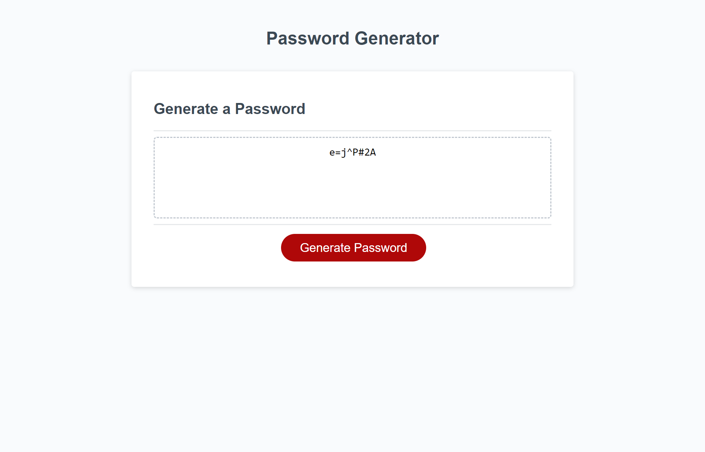

# password-generator

## Description

The purpose of this project was to create a webpage that has a functioning button that generates a password for users. Passwords created with the webpage include options for numbers, upercase, lowercase, and special characters within. 

## Installation

N/A

## Usage

To generate password, press the generate password button. After this you will be prompted to answer questions to narrow down password specifications.

## Credits

N/A

## License

Please refer to the LICENSE in the repo.